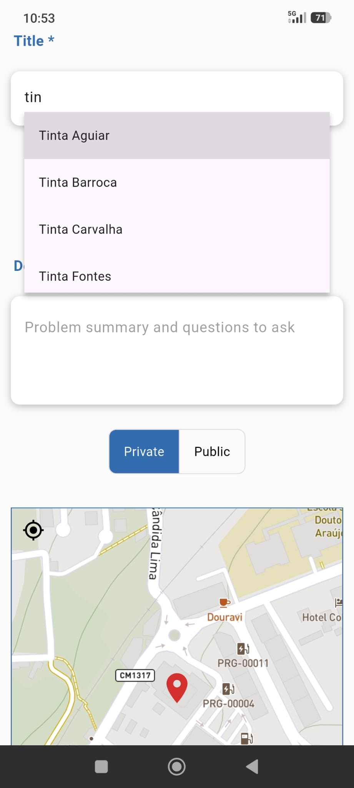

# Castas IVDP

This application was developed to support the creation of structured datasets of grape varieties in the Douro region. It enables the systematic collection of images and data to train artificial intelligence models, with the goal of developing a future platform capable of identifying grape varieties through photos.

The Instituto dos Vinhos do Douro e do Porto (IVDP) is the institution responsible for regulating and certifying Douro and Port wines, and its technical specialists are using this application to catalog and annotate images for the dataset.

  

 
